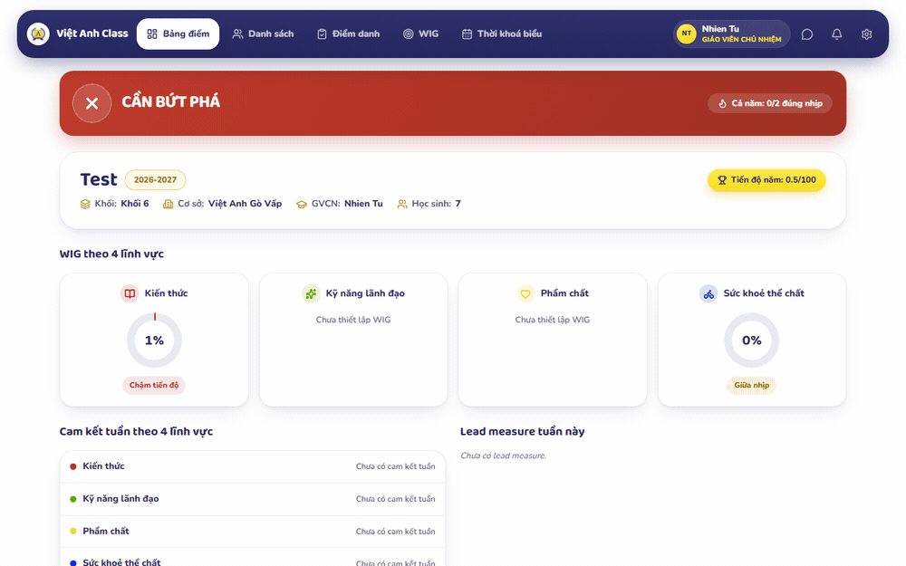
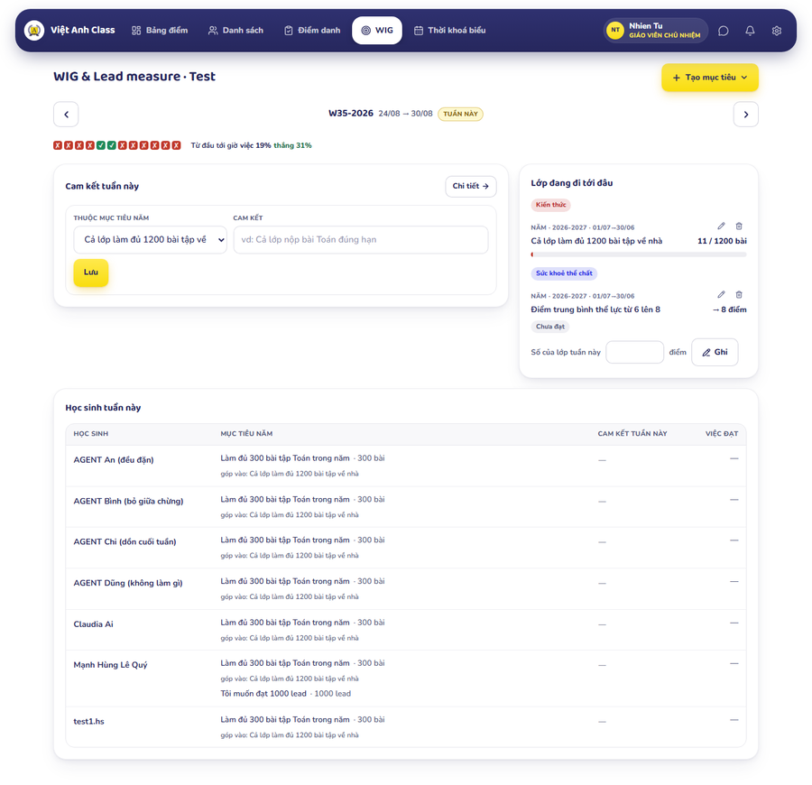
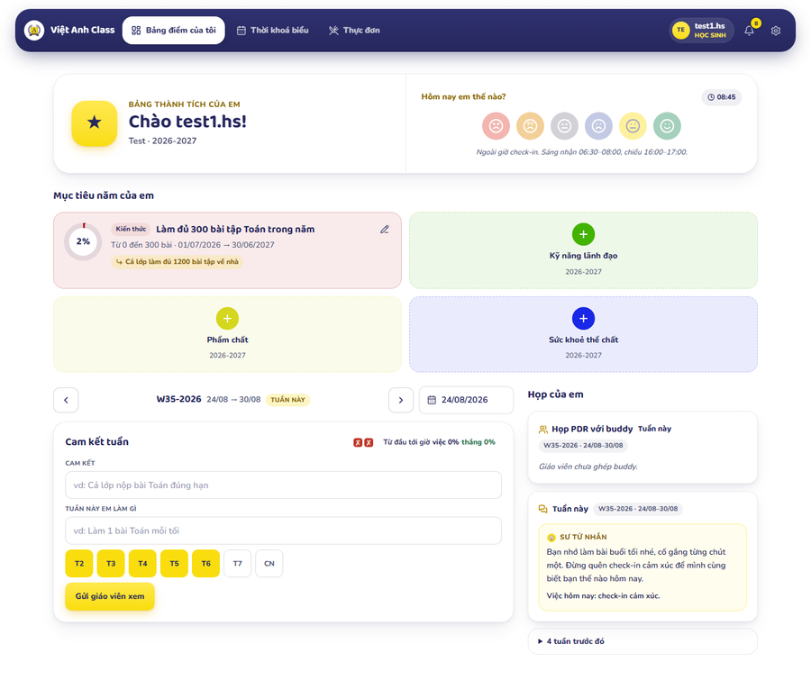
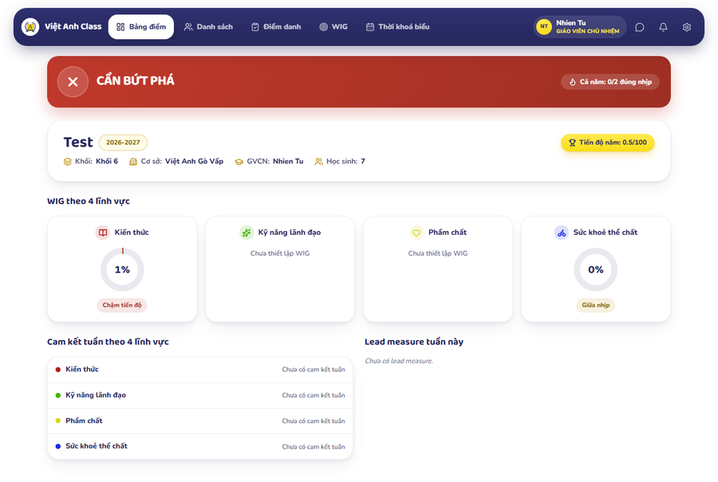
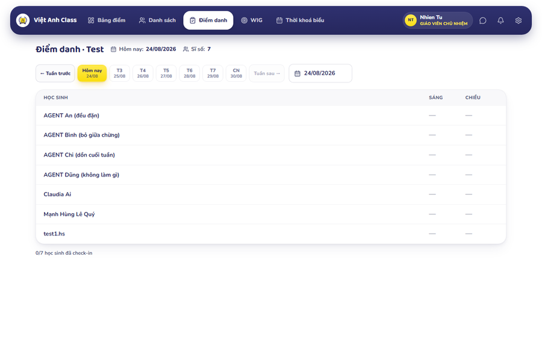

<div align="center">


# Việt Anh Class

**Đưa 4DX vào vận hành lớp học.**
Mục tiêu năm → cam kết tuần → em tự tick việc mình làm. Thầy cô mở một màn là biết cả lớp đang đi tới đâu.

[](https://nextjs.org)
[](https://react.dev)
[](https://www.typescriptlang.org)
[](https://supabase.com)
[](https://tailwindcss.com)
[](messages)



<sub>Ảnh chụp thật từ bản đang chạy, lớp <code>Test</code> — không có dữ liệu học sinh thật.</sub>

</div>

---

## Việt Anh Class là gì

Một app duy nhất cho bốn nhóm người trong trường, mỗi nhóm một việc rất khác nhau:

| Ai | Dùng ở đâu | Việc chính |
|---|---|---|
| **Học sinh** | Điện thoại, giữa giờ hoặc buổi tối | Đặt mục tiêu năm của mình, viết cam kết tuần, tick việc đã làm, check-in cảm xúc, xem thời khoá biểu |
| **Giáo viên chủ nhiệm** | Laptop, trong giờ hành chính | Dựng mục tiêu năm/tuần cho lớp, điểm danh, duyệt cam kết, xếp buddy, xem bảng điểm lớp |
| **Ban giám hiệu** | Laptop | Nhìn cả cơ sở: khối → lớp, quản lý giáo viên, lớp và môn |
| **Phụ huynh** | Điện thoại | Xem báo cáo tuần của con *(cổng phụ huynh sẽ mở ở giai đoạn sau)* |

Thành công của app đo bằng một câu: **thầy cô dựng xong mục tiêu tuần dưới một phút, học sinh mở app là biết tuần này mình cần làm gì và đã làm tới đâu.**

## Mô hình 4DX trong app

```
Mục tiêu NĂM của lớp            "Cả lớp làm đủ 1200 bài tập về nhà"   ← 4 lĩnh vực
   └── Mục tiêu năm của TỪNG EM  "Làm đủ 300 bài tập Toán trong năm"  ← góp vào mục tiêu lớp
        └── Cam kết TUẦN         "Làm 1 bài Toán mỗi tối"             ← em tự đặt, chọn ngày
             └── Em TICK mỗi ngày → bảng vạch X/✓ → % tuần, % tháng, % năm
```

- **Bốn lĩnh vực** cố định: Kiến thức · Kỹ năng lãnh đạo · Phẩm chất · Sức khoẻ thể chất.
- **Bảng vạch** là bảng ghi điểm hấp dẫn của 4DX: nhìn phát biết đang thắng hay thua, không cần đọc số.
- **Họp PDR với buddy**: mỗi tuần hai bạn ngồi lại điểm cam kết của nhau; tick chỉ khoá khi có chữ ký PDR.
- **Buddy 4DX (tuỳ chọn)**: gợi ý ngắn cho em, chạy bằng LLM qua OpenRouter và **chỉ gửi số liệu đã bóc danh tính** (xem [`docs/DATA_GOVERNANCE.md`](docs/DATA_GOVERNANCE.md)).

## Vài màn hình

<table>
<tr>
<td width="50%"><br /><sub><b>WIG &amp; cam kết tuần</b> — mục tiêu lớp, cam kết tuần, từng em đang ở đâu.</sub></td>
<td width="50%"><br /><sub><b>Màn của em</b> — 4 ô mục tiêu, cam kết tuần, check-in cảm xúc, họp buddy.</sub></td>
</tr>
<tr>
<td width="50%"><br /><sub><b>Bảng điểm lớp</b> — tiến độ 4 lĩnh vực và trạng thái tuần.</sub></td>
<td width="50%"><br /><sub><b>Điểm danh</b> — sáng/chiều, đi theo tuần, hôm nay nằm ngay đầu.</sub></td>
</tr>
</table>

## Công nghệ

- **Next.js 15** (App Router, Server Components, server actions) · **React 19** · **TypeScript 5**
- **Tailwind CSS 4**, font Baloo 2 + Nunito, self-host trong `public/fonts`
- **Supabase**: Postgres + Auth + **RLS ở mọi bảng** + edge functions
- **next-intl**: mọi trang nằm dưới `/[locale]` — `vi` (mặc định) và `en`
- **Đăng nhập**: Google SSO giới hạn miền `truongvietanh.com` / `student.truongvietanh.com`, magic link cho phụ huynh. **Không còn đăng nhập demo bằng mật khẩu.**
- **Chạy production**: Docker (Next standalone) → GHCR → Coolify trên VPS. Không dùng Vercel.

## Chạy ở máy

```bash
npm install
cp .env.example .env.local      # rồi điền URL + key Supabase (xem docs/viet-anh-class-claude.md)
npm run dev                     # http://localhost:3000
```

| Lệnh | Việc |
|---|---|
| `npm run dev` | Chạy dev (Turbopack) |
| `npm run build` | Build production (`output: 'standalone'`) |
| `npm run lint` | ESLint |
| `npm run sql -- <file.sql>` | Chạy thẳng một file `.sql` lên Postgres (cần `DATABASE_URL`) |

> ⚠️ `npm start` trên bản standalone **không thay được** dev khi thử server action — dựng thật bằng Docker nếu cần kiểm tra luồng đó.

### Biến môi trường

| Biến | Bắt buộc | Ghi chú |
|---|---|---|
| `NEXT_PUBLIC_SUPABASE_URL` | ✅ | Nội tuyến **lúc build** |
| `NEXT_PUBLIC_SUPABASE_ANON_KEY` | ✅ | Public — RLS mới là thứ bảo vệ dữ liệu |
| `SUPABASE_SERVICE_ROLE_KEY` | ✅ | **Server-only**, đặt ở env runtime. Thiếu → check-in cảm xúc hỏng |
| `DATABASE_URL` | Chỉ ở máy cá nhân | Cho `npm run sql`, cổng **5432** (session mode) |
| `OPENROUTER_API_KEY` · `OPENROUTER_MODEL` | Tuỳ chọn | Bật Buddy 4DX. Thiếu → app vẫn chạy, nút Buddy báo chưa bật |
| `NEXT_PUBLIC_GOOGLE_SSO_ENABLED` | Tuỳ chọn | Chỉ bật **sau khi** làm xong [`docs/google-sso-setup.md`](docs/google-sso-setup.md) |

Chi tiết đặt biến nào ở đâu (build-arg vs runtime): [`docs/DEPLOY.md`](docs/DEPLOY.md) §1.

### Database

Schema, RLS, hàm và RPC nằm trong `supabase/migrations/0001…0155_*.sql` — đánh số tăng dần, chạy bằng Supabase CLI hoặc dán vào SQL Editor. Edge functions: `invite-parent`, `attendance-reminders`.

> Trước khi `create or replace` một hàm, **đọc bản đang chạy trên DB** (`pg_proc`) rồi mới sửa: file trong repo và hàm thật đã từng lệch nhau.

## Kiểm tra

`scripts/` chứa bộ kiểm tự động chạy **thẳng lên bản đang chạy** bằng phiên đăng nhập thật:

```bash
node scripts/test-mobile.mjs           # đo màn 360px, xuất ảnh để nhìn
node scripts/chup-trang.mjs <email> /vi/wig ra.png   # chụp một trang như người dùng thấy
npm run sql -- scripts/test-rls-features.sql         # kiểm RLS, kiểm quyền
```

Quy tắc của dự án: **`tsc` sạch và `next build` xanh không phải bằng chứng**. Trang dynamic phải được dựng thật với phiên đăng nhập; số đo dùng để khoanh vùng, **ảnh** mới dùng để kết luận.

## Deploy

Push lên `main` → GitHub Actions build image → đẩy lên GHCR → Coolify pull và chạy. Sau khi push, chờ `/api/health` trả đúng commit SHA rồi mới đo hay kết luận:

```bash
curl -s https://class.truongvietanh.com/api/health
# {"status":"ok","commit":"..."}
```

Runbook đầy đủ: [`docs/DEPLOY.md`](docs/DEPLOY.md) · tên miền: [`docs/COOLIFY_TEN_MIEN.md`](docs/COOLIFY_TEN_MIEN.md).

## Cấu trúc thư mục

```
app/[locale]/
  (auth)/login              đăng nhập (Google SSO + magic link)
  (dashboard)/              student · grades · roster · attendance · wig · timetable
                            meeting · report · inbox · admin · campus · subjects · gallery
components/                 shell (nav, hướng dẫn, chọn lớp), attendance, student, wig, report, charts
lib/                        supabase (client/server/middleware), auth.ts (RBAC), buddy.ts (LLM)
messages/                   vi.json · en.json — mọi chuỗi phải có cả hai
supabase/migrations/        0001…0155 — schema + RLS + RPC
supabase/functions/         invite-parent · attendance-reminders
scripts/                    bộ kiểm tự động + công cụ đo, chụp màn
docs/                       runbook vận hành, bảo mật, quyền, mô hình WIG
```

## Tài liệu

| File | Nội dung |
|---|---|
| [`docs/viet-anh-class-claude.md`](docs/viet-anh-class-claude.md) | **Sửa ý nhỏ bằng Claude** — cho người không phải lập trình viên: cài gì, gõ gì, đừng làm gì |
| [`CLAUDE.md`](CLAUDE.md) | Luật của dự án — thứ Claude đọc đầu mỗi phiên |
| [`PRODUCT.md`](PRODUCT.md) | Người dùng, tính cách sản phẩm, nguyên tắc thiết kế |
| [`docs/MO_HINH_WIG.md`](docs/MO_HINH_WIG.md) | Mô hình WIG — năm, tuần, lead measure |
| [`docs/ROLE_MATRIX.md`](docs/ROLE_MATRIX.md) | Vai trò nào thấy gì, làm được gì |
| [`docs/DATA_GOVERNANCE.md`](docs/DATA_GOVERNANCE.md) | Dữ liệu trẻ em: giữ gì, gửi đi đâu |
| [`docs/DOI_TEN_MIEN.md`](docs/DOI_TEN_MIEN.md) | Đổi tên miền app — thứ tự bấm ở Cloudflare/Coolify/Supabase/Hub, đường lui |
| [`docs/DEPLOY.md`](docs/DEPLOY.md) · [`docs/SETUP_AUTH.md`](docs/SETUP_AUTH.md) · [`docs/SETUP_EMAIL.md`](docs/SETUP_EMAIL.md) | Runbook hạ tầng |
| [`docs/M8_HARDENING.md`](docs/M8_HARDENING.md) | Rà soát bảo mật và những chỗ đã vá |
| [`docs/NAV_IA.md`](docs/NAV_IA.md) · [`docs/PILOT_SUCCESS_METRICS.md`](docs/PILOT_SUCCESS_METRICS.md) | Điều hướng · thước đo giai đoạn thí điểm |

## Hai luật khi sửa app

1. **Không đổi bản sắc đã có.** Navy `#26275d` + gold `#f9dd0e`, Baloo 2 + Nunito, nền trắng. Cải thiện là *trong* hệ này, không thay hệ.
2. **Chữ trên màn phải để học sinh lớp 5 đọc hiểu ngay.** Không biệt ngữ — viết "Việc" chứ không "lead", "Từ đầu tới giờ" chứ không "luỹ kế", "thầy cô" chứ không "cô".

---

<sub>Sản phẩm nội bộ của Trường Việt Anh.</sub>
